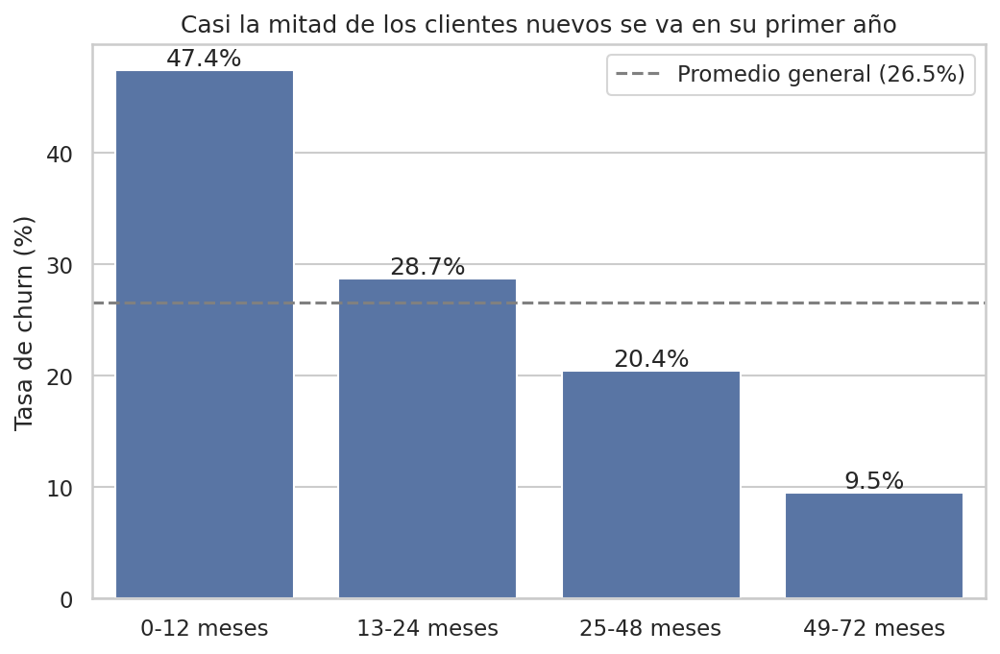

# ¿Por qué se van los clientes? Análisis de churn

Análisis exploratorio del dataset *Telco Customer Churn* (IBM, ~7.000 clientes)
para identificar qué características se asocian con la baja de clientes
y proponer acciones de retención.

## Pregunta de negocio
¿Qué perfil tienen los clientes que se dan de baja y qué podría hacer
la empresa para retenerlos?

## Herramientas
Python (pandas), SQL (DuckDB), matplotlib y seaborn, en Google Colab.

## Hallazgos principales
- La tasa de churn general es del **26,5%**.
- **El tipo de contrato es el factor más fuerte:** los clientes mes a mes
  se van en un 42,7%, contra el 2,8% de los contratos a dos años.
- **El primer año es crítico:** el 47,4% de los clientes con hasta 12 meses
  de antigüedad se da de baja, y la tasa baja a 9,5% después de los 4 años.
- **El pago con cheque electrónico se asocia con más bajas** (45,3%, contra
  15-19% en los demás métodos), y el patrón se repite en los tres tipos
  de contrato. El peor caso: mes a mes + cheque electrónico, con 53,7%.

## Recomendaciones
1. Incentivar el pase a contratos anuales durante los primeros meses.
2. Reforzar la experiencia del primer año (onboarding, seguimiento).
3. Promover el débito automático con un beneficio, sobre todo en
   clientes mes a mes que pagan con cheque electrónico.

## Limitaciones
- Los resultados muestran asociaciones, no relaciones causales.
- Las variables se analizaron de a una o de a dos; otros factores
  podrían explicar parte de los efectos.
- Se trata de un dataset de ejemplo, no de datos reales de una empresa.

## Proceso
1. **Limpieza:** `TotalCharges` venía como texto por 11 clientes sin cargos
   (antigüedad 0); se convirtió a número y se completó con 0.
2. **Análisis:** tasas de churn por segmento con SQL sobre el DataFrame.
3. **Visualización:** gráficos con el hallazgo en el título.
